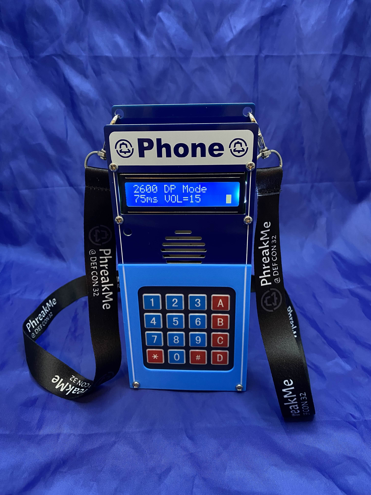
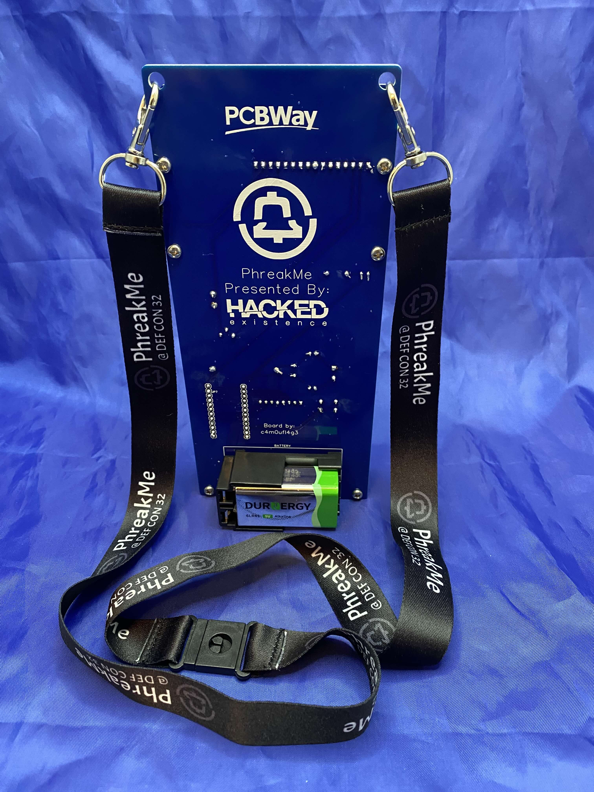
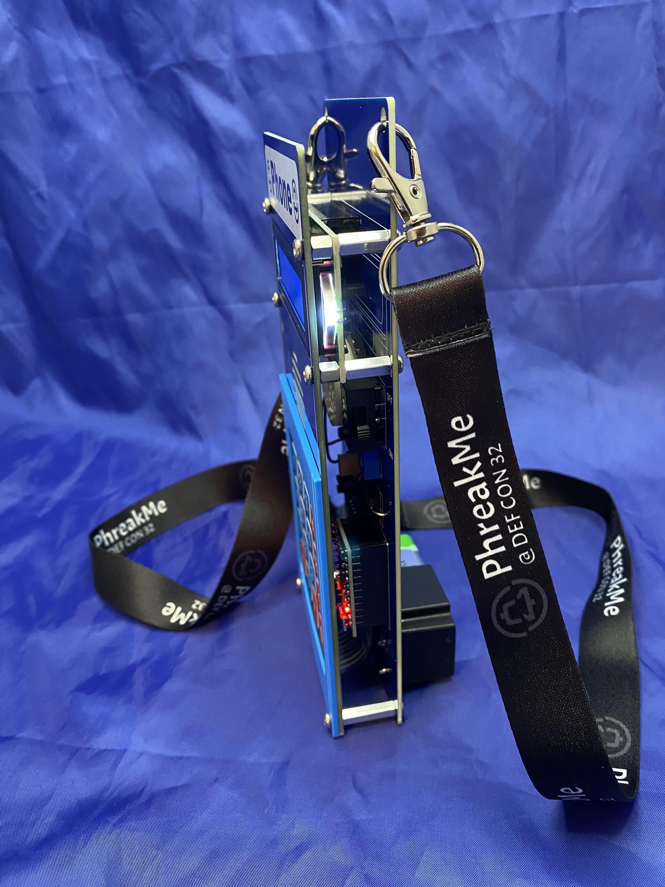
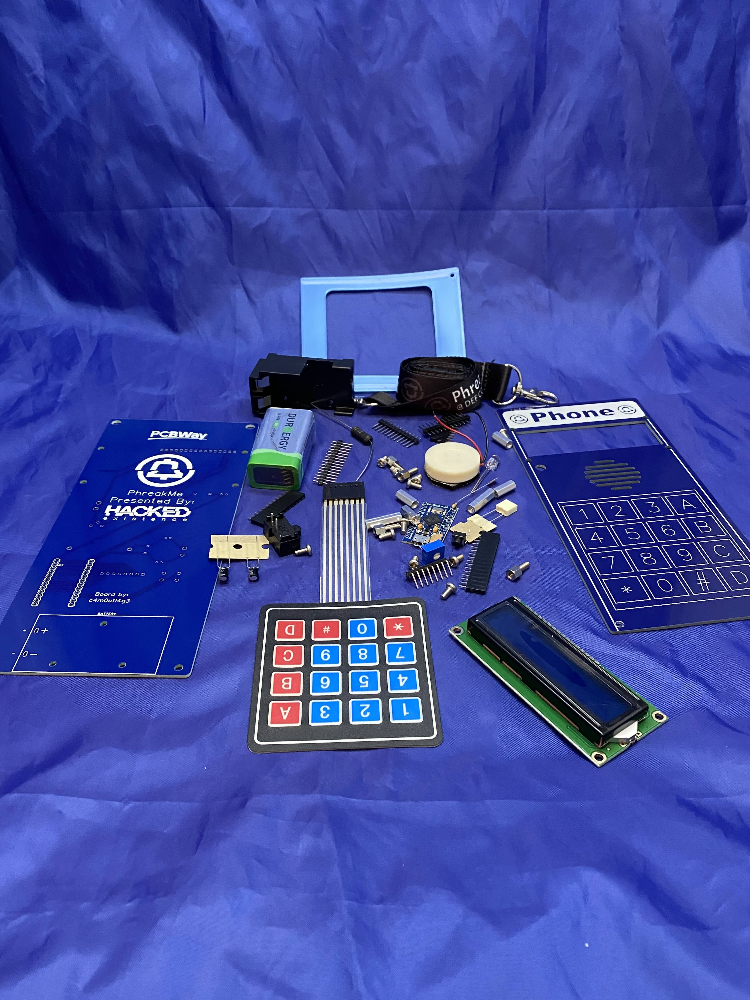

# PhreakMe DefCon 32 CTF

## The CTF
Visit [PhreakMe.com](http://phreakme.com) to register and view instructions on navigating the CTF.
Give us a call at 212-203-4977!

## The Badge
>[!CAUTION]
>Please pay attention to the 9V Battery polarity, do not plug the battery in backwards or you will fry your board!

The badge design was based on the software blue box from [Projectmf.org](http://projectmf.org).  It runs a slightly modified version of the arduino code from Projectmf.

### Badge Operation
Operating instructions can be found [here](/blue_box_manual.pdf)

### Building the Badge
Badge assembly video can be found on YouTube [here](https://youtu.be/mM0XuOlJHrs?si=l56OoVdzHynPDADL)

### Flashing the Badge Firmware
The badge kits come pre-flashed with the software blue box firmware flashed onto the included arduino pro micro board.  If you would like to flash your own arduino pro micro, the arduino project along with the required libraries can be found in the PhreakMeBlueBoxBadgeFirmware folder of this repo.

### Purchasing a Badge Kit
If you would like to purchase a badge, they are available [here](https://www.etsy.com/listing/1763116668/phreakme-badge-kit)

## The Con
Huge contragulations to the Psychoholics for winning a Black Badge at DefCon 32 by capturing every flag in the CTF.  Big thanks to everyone who came by our booth and participated in the CTF!
